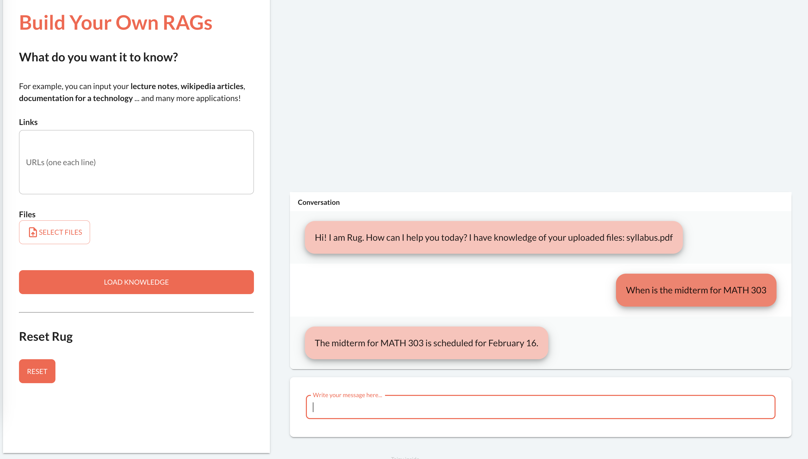
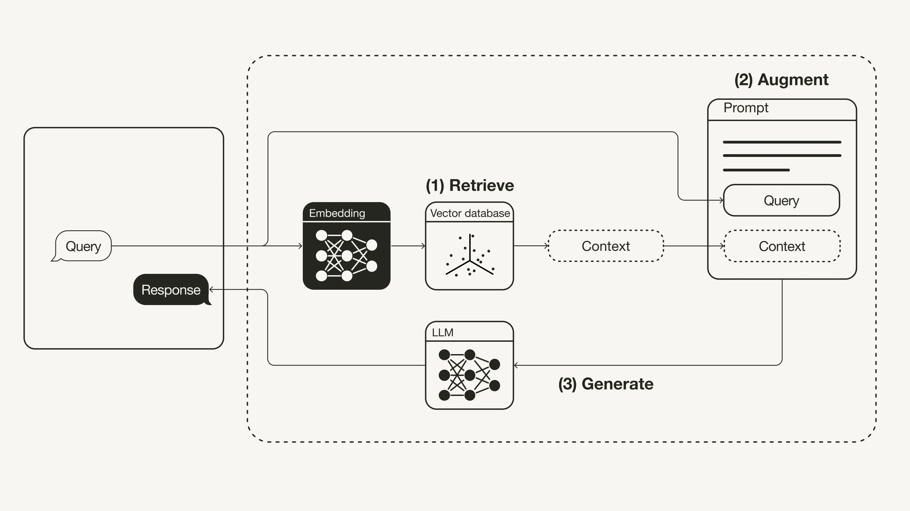

# RAG-U

Customizing retreival augmented generation (RAG) chatbots - for U!

## What is RAG?

Retreival augmented generation (RAG) is a modern approach to optimizing the outputs of large language models (LLMs) in production. The RAG architecture provides the LLM with **custom materials/documents (of your choosing)** to *ground* the generated answers upon, improving reliability and reducing LLM hallucinations. It allows LLMs to become an "expert" in your supplied information. 

This promising approach has [already been adopted by companies like AWS, IBM, Google, Microsoft, NVIDIA](https://blogs.nvidia.com/blog/what-is-retrieval-augmented-generation/), and made many believe [2024 is the "year of the RAG"](https://medium.com/predict/2024-year-of-the-rag-581f7fd423f4).

([img source](https://towardsdatascience.com/retrieval-augmented-generation-rag-from-theory-to-langchain-implementation-4e9bd5f6a4f2))

To read more, this is a great introduction from [NVIDIA Blog](https://blogs.nvidia.com/blog/what-is-retrieval-augmented-generation/).

## What does RAG-U do?

RAG-U provides a simple, no-code interface for you to build your own RAG-powered chatbots. Simply upload your **PDF documents** or your text-based webpage URLs, "load" the knowledge into RAGU, and chat away as if that knowledge was in ChatGPT's knowledge all along.

## Demo

## Slides

This project was completed and presented at nwHacks 2024, and you can see my accompanying slideshow [here](https://docs.google.com/presentation/d/1KFv356uHVDhtv_b83GKmrXqJ59rG9K0AXE_-LtvA3UQ/edit?usp=sharing). It was a top performer in the "Best Use of Taipy" category.

## Architecture
`RAGU` was built with Python, using [LangChain](https://python.langchain.com/docs/get_started/introduction) as the orchestration service, and [taipy](https://github.com/Avaiga/taipy) as the front-end. RAGU is powered by OpenAI's GPT-3.5 model, and uses [Facebook AI Similarity Search (FAISS)](https://python.langchain.com/docs/integrations/vectorstores/faiss) for the vector database for text. [`PyMuPDF`](https://github.com/pymupdf/PyMuPDF) performs PDF parsing, and [`BeautifulSoup4`](https://pypi.org/project/beautifulsoup4/) and [`lxml`](https://pypi.org/project/lxml/) handle URL parsing.

## Next up

- Stay tuned for a publicly deployed version of RAGU!
- Add multi-agent support to enhance context retrieval ([#4](https://github.com/xoo-creative/rag-u/issues/4))
- Enable GPT-4 on RAGU ([#8](https://github.com/xoo-creative/rag-u/issues/8))

